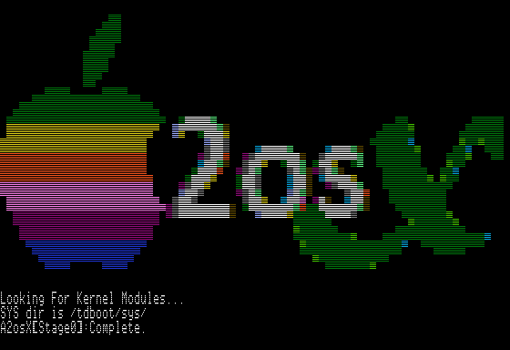

# A3osX Multi-Tasking OS for Apple ///  

### Updated Apr 20, 2022

## A3osX

## Introduction

A3osX is an operating, programming and execution environment for the Apple /// and Apple ///+ computers.  While layered atop of SOS, taking advantage of all SOS block devices and MLI calls; A3osX is much more than an application or command shell. Written in 6502 assembly for speed of execution and efficient memory management; A3osX is a multitasking and yes multi-user development environment bringing many of today's server operating system features to our venerable vintage 8-bit systems. 

The foundation of A3osX enabling its multi-user multitasking capabilities is a reusable set of APIs and LIBs (written in Assembly) that all programs can and do use which make them very lean and fast.  For instance, there is one network API that any program can call which in turn handles the I/O to different brands of LAN cards via a set of drivers.  In addition, multiple programs can be using the network at the same time such as the TELNETD server and the TELNET client.  A key benefit is that code for each program is smaller because the network API is doing a great deal of the work.  With CORE APIs like printf and LIBs such as Network loaded only once (much like a DLL in Windows) memory is conserved, providing more resources to support your A3osX programs.

## Requirements

A3osX is designed to work on any Apple /// or Apple ///+ computer.

Consult the **[documentation](#documentation)** section below to find other resources available to you for learning how to install, use, develop and test A3osX.

## How You Can Help

The A3osX Team welcomes your help in making this the best operating environment for the Apple ///!  Specifically, the more users who can test the most current RELEASE, CANDIDATE or STABLE media on their unique hardware and report back their findings, the better A2osX becomes.  In addition, comments on, suggestions, or contributions to our documentation are greatly appreciated.  Lastly, A3osX would not be what it is without our great core development team. We could certainly use more developers, especially in Assembly (S-C Assembler familiar even better) to contribute new utilities, applications and features for A3osX.

### Join us on Slack!

We are inviting interested developers and testers to please join our A2osX Slack channel to get release announcements, learn more about new features, get support and provide feedback.  An invite to our Slack channel can be found **[here](https://join.slack.com/t/a2osx/shared_invite/zt-ens62cl0-xeAFLjlRfUSMtzdc6o~Xew)**.

## License
A3osX is licensed under the GNU General Public License.

    This program is free software; you can redistribute it and/or modify
    it under the terms of the GNU General Public License as published by
    the Free Software Foundation; either version 2 of the License, or
    (at your option) any later version.

    This program is distributed in the hope that it will be useful,
    but WITHOUT ANY WARRANTY; without even the implied warranty of
    MERCHANTABILITY or FITNESS FOR A PARTICULAR PURPOSE.  See the
    GNU General Public License for more details.

The full A3osX license can be found **[Here](../LICENSE)**.

## Copyright

Copyright 2022, Remy Gibert and the A2osX contributors.
